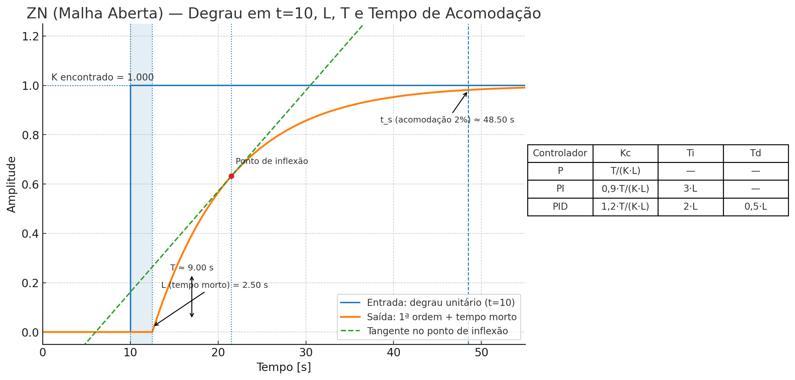

# Ziegler–Nichols — Método da Reação ao Degrau (Malha Aberta)

Este documento descreve **apenas** o método de **malha aberta** de Ziegler–Nichols para sintonia de controladores **P / PI / PID** com base na **curva de reação ao degrau** (*FOPDT*).

---

## 1) Modelo usado (FOPDT)

A curva de resposta ao degrau da planta é aproximada por um modelo de **1ª ordem com atraso**:

$$
G(s) = \frac{K\,e^{-L s}}{T s + 1}
$$

Onde:
- **K** → ganho do processo (variação final de saída ÷ amplitude do degrau)  
- **L** → atraso morto (tempo sem resposta após o degrau)  
- **T** → constante de tempo (relacionada à inclinação máxima da curva)

---

## 2) Como medir **K**, **L** e **T**

1. Coloque o sistema em **manual/malha aberta** e aplique um degrau conhecido de amplitude $\Delta u no instante $t_0$.  
2. Meça a variação final da saída $\Delta y$ e calcule:
   $
   K = \frac{\Delta y}{\Delta u}
   $
3. Trace a **reta tangente** no ponto de maior inclinação da resposta (ponto de inflexão).  
4. **Atraso morto (L)**: distância entre $t_0$ e a interseção da tangente com o nível inicial da saída.  
5. **Constante de tempo (T)**: distância entre essa interseção inicial e a interseção da tangente com o nível final.

---

## 3) Regras de sintonia (Ziegler–Nichols — Reação ao Degrau)

| Controlador | $K_c$                                  | $T_i$    | $T_d$   |
|-------------|----------------------------------------|----------|-----------|
| **P**       | $\frac{T}{K\,L}$                       | —        | —         |
| **PI**      | $0{,}9\,\frac{T}{K\,L}$                | $3L$     | —         |
| **PID**     | $1{,}2\,\frac{T}{K\,L}$                | $2L$     | $0{,}5L$|

> **Conversão para $K_p, K_i, K_d$**:  
> $$
> K_p = K_c,\quad K_i = \frac{K_c}{T_i},\quad K_d = K_c\,T_d
> $$

---

## 4) Exemplo rápido

Dados:
- $\Delta u = 0{,}10$  
- $\Delta y = 5{,}0$ → $K = 50$  
- $L = 2{,}5\,s$  
- $T = 9{,}0\,s$  

**PID (ZN):**
$$
K_c = 1{,}2\frac{T}{K\,L} = 0{,}0864
$$
$$
T_i = 2L = 5{,}0\,s \quad\Rightarrow\quad K_i = 0{,}01728\ \text{s}^{-1}
$$
$$
T_d = 0{,}5L = 1{,}25\,s \quad\Rightarrow\quad K_d = 0{,}108
$$

> **Figura (passo-a-passo visual)**  
>   
> **Arquivo:** [assets/ZN_open_loop_step_t10.png](assets/ZN_open_loop_step_t10.png)

---

## 5) Ranges dos transmissores do processo

| Tag       | Mínimo      | Máximo         | Unidade     |
|-----------|-------------|----------------|-------------|
| FV100CA   | 0           | 100            | %           |
| FV100AR   | 0           | 100            | %           |
| FV100A    | 0           | 100            | %           |
| LIT100    | 0           | 100            | %           |
| FIT100V   | 0           | 0,3500         | kg/s        |
| PIT100A   | 0           | 600            | kPa         |
| PIT100V   | 0           | 10             | bar         |
| FIT100CA  | 0,00001     | 0,0227         | kg/s        |
| TIT100    | 0           | 1000           | °C          |
| FIT100AR  | 0,00001     | 0,1500         | kg/s        |
| FIT100A   | 0           | 0,5500         | kg/s        |

---

## 6) Boas práticas e limitações

- O método ZN (malha aberta) tende a produzir **resposta rápida com overshoot**.  
  Se oscilar muito: reduza $K_c$ em 10–30%, aumente $T_i$ e/ou reduza $T_d$.
- Utilize **derivada filtrada**:
  $$
  D(s) = K_c\,T_d \frac{N s}{1+N s}, \quad N \approx 10\text{–}20
  $$
- Ative **anti-windup** na integral.
- Mais adequado quando $0{,}2 \leq L/T \leq 0{,}4$.  
  Para processos com **grande atraso morto** ou **integradores dominantes**, considere IMC, Tyreus–Luyben, Åström–Hägglund ou ajuste manual.

---

## 7) Conversão para o **PID do CODESYS**

Blocos comuns: `PID` (Standard.library) e `PIDCompact`  
→ tempos em **segundos**, parâmetros: **KP**, **TN** (integral) e **TV** (derivativo).

- **Forma direta:**
```pascal
KP := Kc;
TN := Ti;   // tempo integral
TV := Td;   // tempo derivativo
// CYCLE conforme task, ex.: 0.05 s
```

- **Se pedir Ki/Kd:**
```pascal
Ki := Kc / Ti;    // [s^-1]
Kd := Kc * Td;    // [s]
```

**Exemplo numérico:**
```
Kc = 4,32
Ti = 5,00 s
Td = 1,25 s

// CoDeSys:
KP = 4,32
TN = 5,00 s
TV = 1,25 s

// Alternativa:
Ki = 0,864 s^-1
Kd = 5,40
```
