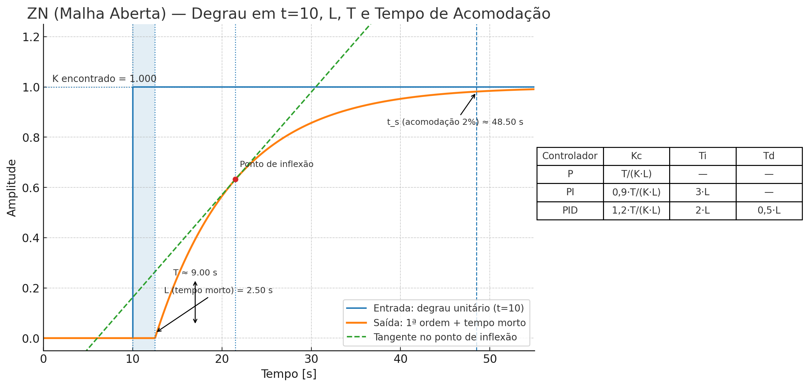

# Ziegler–Nichols — Método da Reação ao Degrau (Malha Aberta)

Este documento descreve **apenas** o método de **malha aberta** de Ziegler–Nichols para sintonia de controladores **P / PI / PID** com base na **curva de reação ao degrau** (FOPDT).

---

## 1) Modelo usado (FOPDT)

A curva de resposta ao degrau da planta é aproximada por um modelo de **1ª ordem com atraso**:

$$
G(s) = \frac{K\,e^{-L s}}{T s + 1}
$$

- **K**: ganho do processo (razão entre a variação final de saída e a amplitude do degrau).
- **L**: atraso morto (tempo sem resposta após o degrau).
- **T**: constante de tempo (relacionada à inclinação máxima da curva).

---

## 2) Como medir **K**, **L** e **T**

1. Coloque o sistema em **manual/malha aberta** e aplique um **degrau conhecido** de amplitude $\Delta u$ no instante $t_0$.  
2. Meça a variação final da saída $\Delta y$ e calcule:
   $$
   K = \frac{\Delta y}{\Delta u}
   $$
3. Trace a **reta tangente** no ponto de **maior inclinação** da resposta (ponto de inflexão).
4. **Atraso morto $L$**: distância, no eixo do tempo, entre $t_0$ e a interseção da tangente com o nível inicial da saída.  
5. **Constante de tempo $T$**: distância, no eixo do tempo, entre aquela mesma interseção inicial e a interseção da tangente com o **nível final**.

---

## 3) Regras de sintonia (Ziegler–Nichols — Reação ao Degrau)

Para os parâmetros \((K_c, T_i, T_d)\) do controlador:

- **P**
  $$
  K_c = \frac{T}{K\,L}
  $$

- **PI**
  $$
  K_c = 0{,}9\,\frac{T}{K\,L}, \qquad T_i = 3\,L
  $$

- **PID**
  $$
  K_c = 1{,}2\,\frac{T}{K\,L}, \qquad T_i = 2\,L, \qquad T_d = 0{,}5\,L
  $$

Se a sua implementação usa \((K_p, K_i, K_d)\), converta por:
$$
K_p = K_c, \qquad K_i = \frac{K_c}{T_i}, \qquad K_d = K_c\,T_d
$$

---

## 4) Exemplo rápido

Para um degrau $\Delta u = 0{,}10$, mediu-se $\Delta y = 5{,}0$ (logo $K=50$); a tangente dá $L=2{,}5\,\text{s}$ e $T=9{,}0\,\text{s}$.

**PID (ZN):**
$$
K_c = 1{,}2\,\frac{T}{K\,L} = 1{,}2\,\frac{9}{50\cdot 2{,}5} = 0{,}0864
$$
$$
T_i = 2L = 5{,}0\,\text{s} \quad\Rightarrow\quad K_i = \frac{0{,}0864}{5} = 0{,}01728\ \text{s}^{-1}
$$
$$
T_d = 0{,}5L = 1{,}25\,\text{s} \quad\Rightarrow\quad K_d = 0{,}0864 \cdot 1{,}25 = 0{,}108
$$

> **Figura (passo-a-passo visual):**  
>   
> **Arquivo:** [assets/ZN_open_loop_step_t10.png](assets/ZN_open_loop_step_t10.png)

---


## 5) Boas práticas e limitações

- ZN (malha aberta) tende a produzir resposta **rápida com overshoot**. Se oscilar demais:  
  reduza $K_c$ em 10–30%, aumente $T_i$ e/ou reduza $T_d$.
- Use **derivada filtrada** ($D(s) = K_c\,T_d \frac{N s}{1+N s}$, $N\approx 10\text{–}20$) e **anti-windup** na integral.
- O método é mais adequado quando a razão $L/T$ não é muito grande. Para processos com **grande atraso morto** ou **integradores dominantes**, considere alternativas (IMC, Tyreus–Luyben, Åström–Hägglund) ou ajuste fino manual.

---

## 6) Conversão para o **PID do CODESYS**

**Blocos comuns:** `PID` (Standard.library) e `PIDCompact`. Ambos aceitam tempos em **segundos** e usam os nomes **KP**, **TN** (integral) e **TV** (derivativo).

- Atribuições diretas:
```
KP := Kc;
TN := Ti;   // tempo integral
TV := Td;   // tempo derivativo
// CYCLE (tempo de amostragem) conforme sua task, ex.: 0.05 s
```
- Se seu bloco pedir **Ki** e **Kd** (em vez de TN/TV):
```
Ki := Kc / Ti;    // [s^-1]
Kd := Kc * Td;    // [s]
```

**Exemplo numérico (PID pelo ZN malha aberta)** para a figura (`K=1, L=2,5 s, T=9 s`):  
```
Kc = 1,2*T/(K*L) = 4,32
Ti = 2*L = 5,00 s
Td = 0,5*L = 1,25 s

// CoDeSys:
KP = 4,32
TN = 5,00 s
TV = 1,25 s
// Alternativa (se Ki/Kd):
Ki = 0,864 s^-1
Kd = 5,40
```
